<p align="center">
  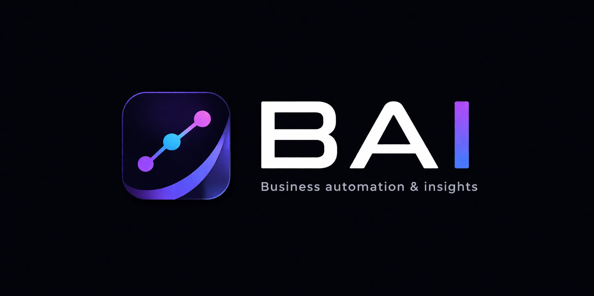
</p>

<h1 align="center">BAI SmartSuite</h1>

<p align="center">
  <strong>Run Your Business. Know It Better.</strong><br>
  An all-in-one enterprise platform for boards, projects, HR, knowledge, and more.
</p>

<p align="center">
  
  
  
  
  
</p>

---

## Product Suite

BAI SmartSuite is a multi-product SaaS platform. Each product has its own module, layout, and feature set — all running under one unified organization workspace.

<p align="center">
  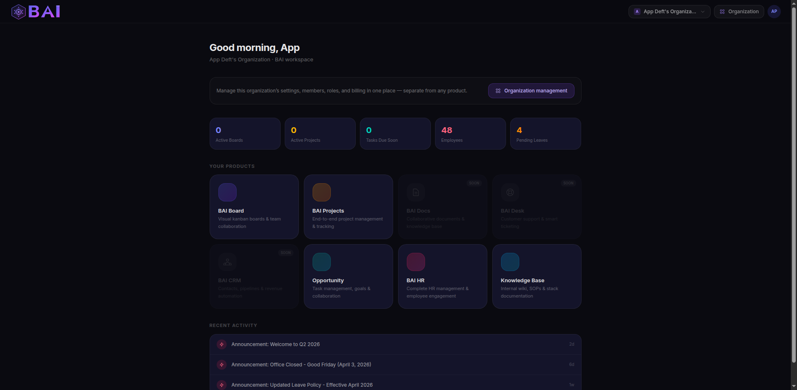
</p>

| Product | Description | Status |
|---------|------------|--------|
| **SmartBoard** | Kanban boards & task collaboration | Live |
| **SmartProjects** | Full project management with sprints, timelines, billing | Live |
| **Opportunity** | Asana-style task management with portfolios & goals | Live |
| **BAI HR** | Complete HRMS — people, payroll, attendance, recruitment | Live |
| **Knowledge Base** | Internal docs & knowledge management | Live |
| BAI CRM | Customer relationship management | Coming Soon |
| BAI Docs | Document collaboration | Coming Soon |
| BAI Desk | Helpdesk & ticketing | Coming Soon |

---

## BAI HR — Complete HRMS

A full-featured Human Resource Management System built as a Keka-inspired module within the BAI platform.

### Dashboard

Real-time overview of your workforce — headcount, department breakdown, new joiners, birthdays, anniversaries, and recent exits.

<p align="center">
  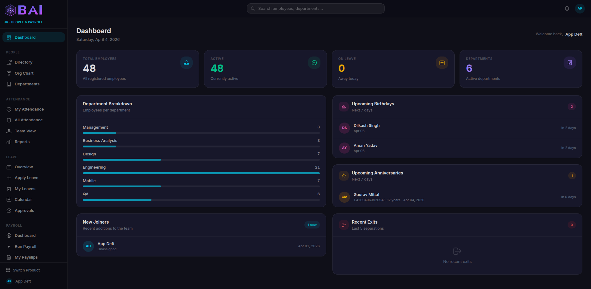
</p>

### People Directory & Org Chart

Browse all employees in grid or list view. Filter by department, status, employment type. Full employee profiles with personal details, employment history, education, skills, and documents.

<p align="center">
  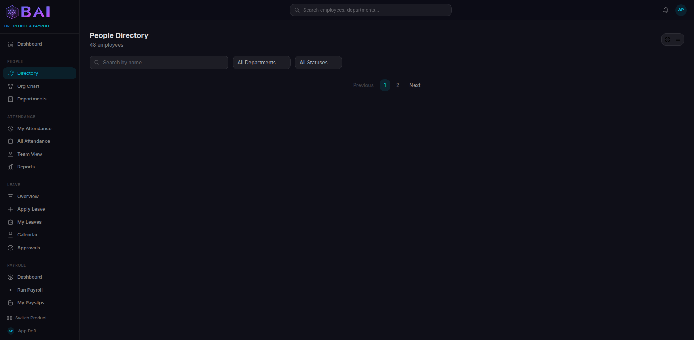
  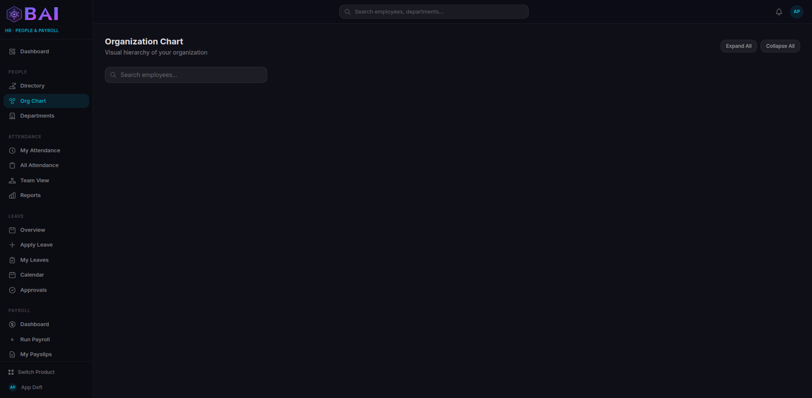
</p>

### Departments

Create and manage departments with heads, hierarchy, and employee counts.

<p align="center">
  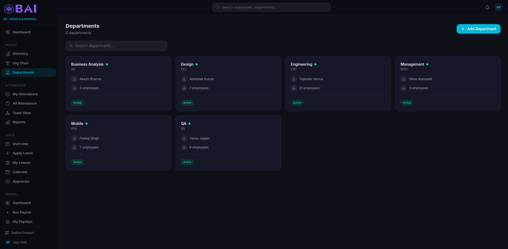
</p>

### Attendance

Clock in/out with live timer. Monthly calendar view with color-coded days. Team attendance grid for managers. Exportable attendance reports.

<p align="center">
  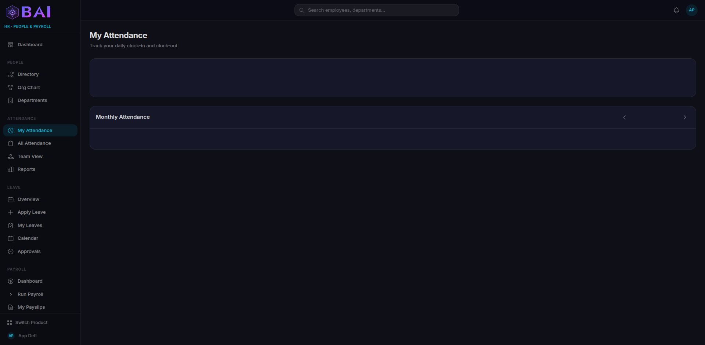
</p>

### Leave Management

Apply for leave, track balances, manage approvals. Monthly calendar showing team availability. Support for half-day, comp-off, and multiple leave types.

<p align="center">
  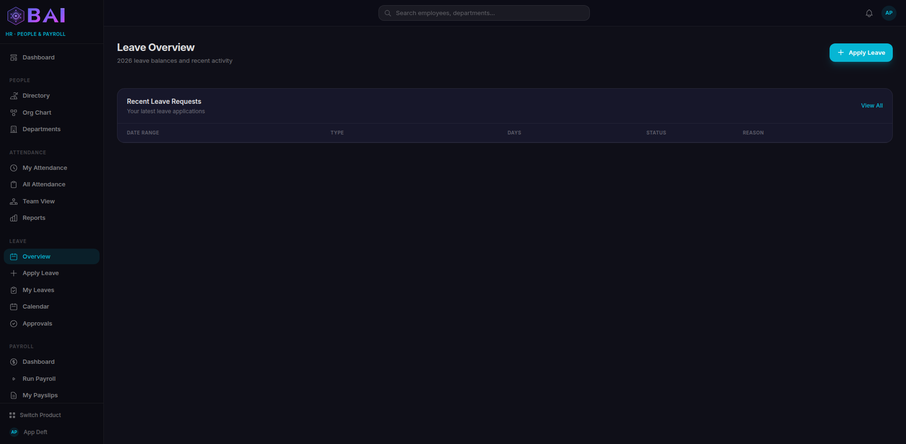
  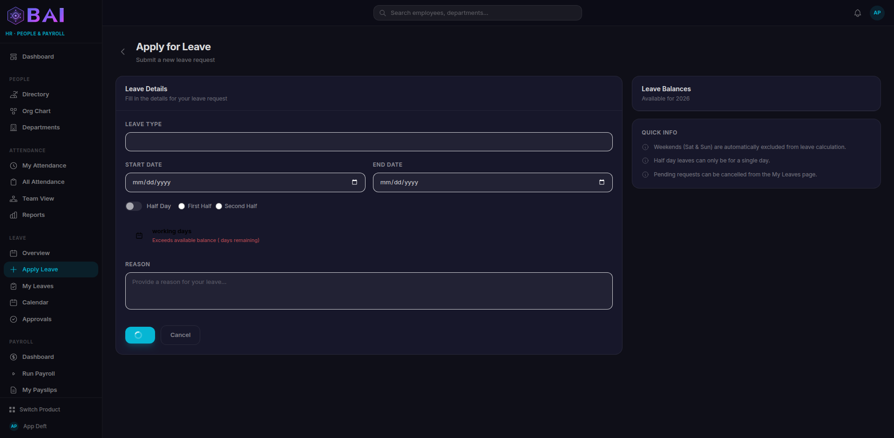
</p>

### Payroll

Process monthly payroll, manage salary structures, view payslips. Support for Indian statutory deductions (PF, ESI, TDS, Professional Tax).

<p align="center">
  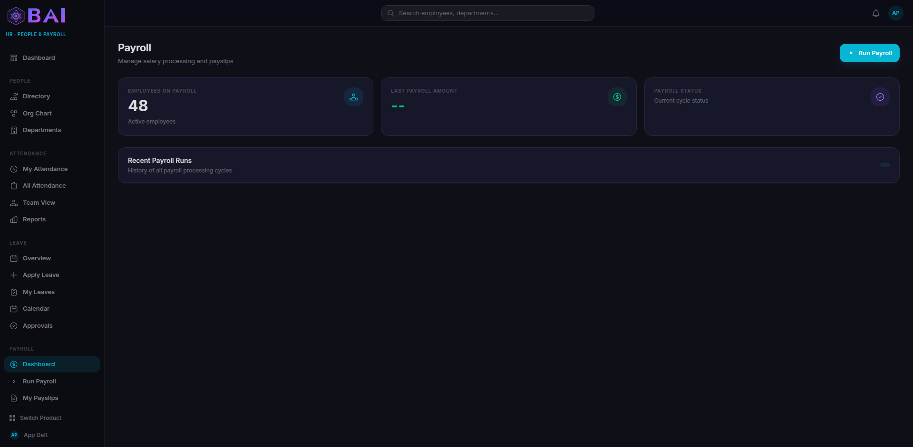
  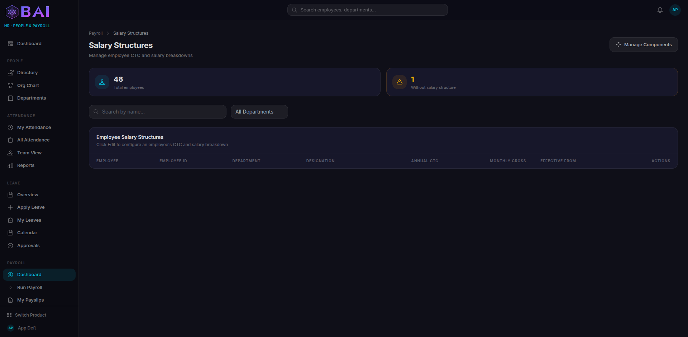
</p>

### Performance

Create review cycles (quarterly/half-yearly/annual). Self-reviews with star ratings. Goal tracking with progress bars. KRA-based performance evaluation.

<p align="center">
  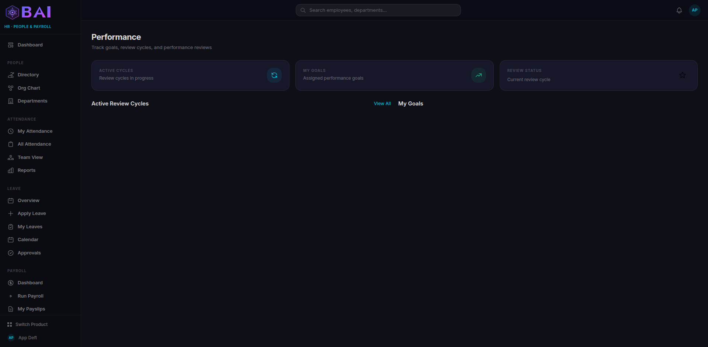
</p>

### Recruitment

Post job openings, manage candidates through a Kanban pipeline (Applied > Screening > Interview > Offer > Hired). Schedule interviews and submit feedback.

<p align="center">
  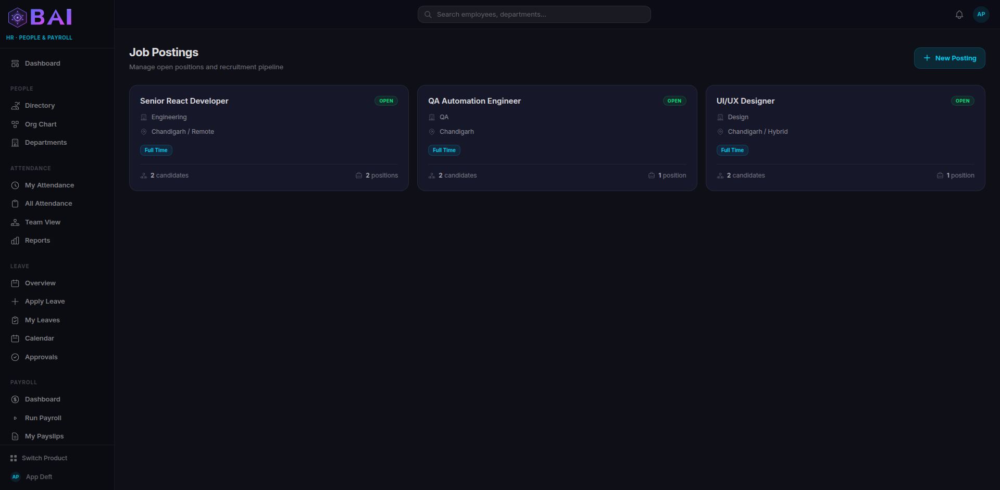
</p>

### Expense Management

Submit expense claims with line items, receipts, and categories. Multi-level approval workflow. Track reimbursement status.

<p align="center">
  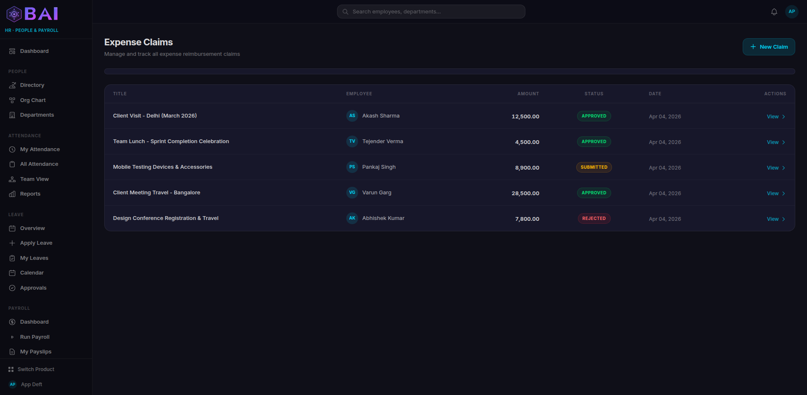
</p>

### Engagement

Team birthdays & work anniversaries. Peer-to-peer recognition (badges, awards, shoutouts). Company announcements with pinning.

<p align="center">
  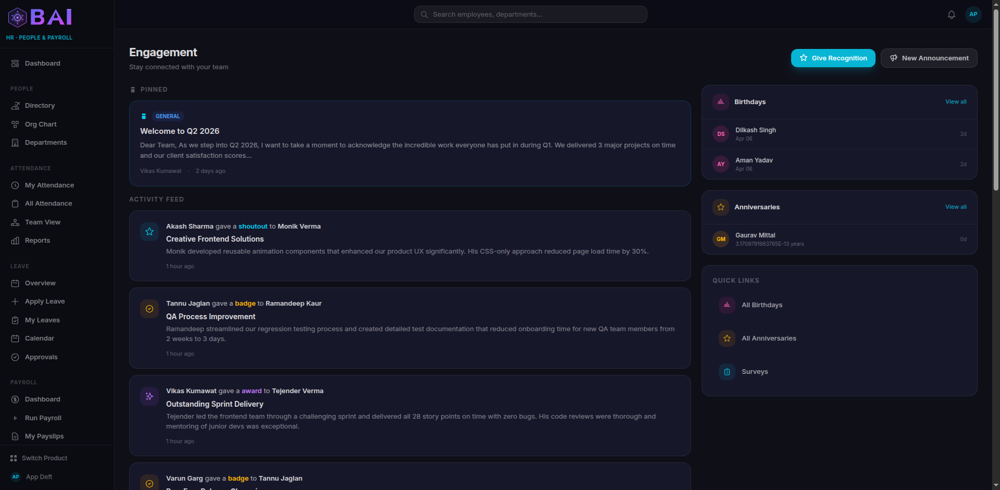
  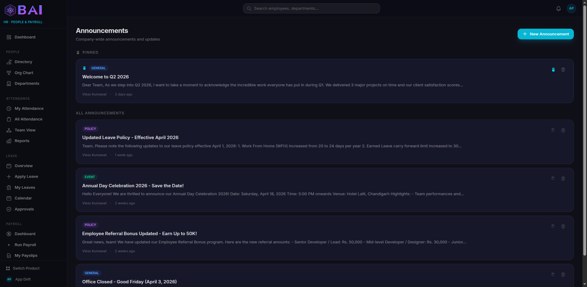
</p>

### Surveys

Create employee pulse surveys with multiple question types (rating, text, multiple choice, yes/no). Anonymous survey support. Response analytics with charts.

<p align="center">
  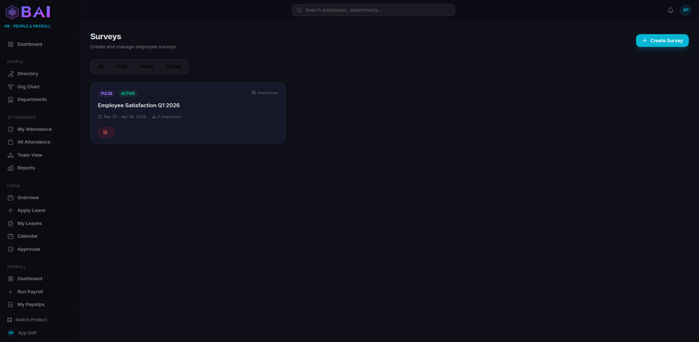
</p>

---

## Architecture

```
BAI SmartSuite
├── Multi-tenant SaaS (organization-scoped data)
├── Product-based access control (per-org subscriptions)
├── Role-based permissions (Owner / Admin / Member + custom roles)
├── Dark theme UI with per-product color theming
└── RESTful API + Alpine.js reactive frontend
```

### Tech Stack

| Layer | Technology |
|-------|-----------|
| Backend | Laravel 13 (PHP 8.3) |
| Database | MySQL 8 |
| Frontend | Tailwind CSS 4 + Alpine.js 3 |
| Build | Vite 8 |
| Auth | Laravel built-in + GitHub OAuth |
| Testing | Laravel Dusk (browser tests) |

### HR Module Numbers

| Component | Count |
|-----------|-------|
| Database Tables | 37 |
| Eloquent Models | 37 |
| Web Controllers | 12 |
| API Controllers | 9 |
| Blade Views | 42 + 1 layout |
| Service Classes | 4 |
| Artisan Commands | 4 |
| Web Routes | 45+ |
| API Endpoints | 34 |
| Dusk Tests | 102 |

---

## Getting Started

### Requirements

- PHP 8.3+
- MySQL 8.0+
- Node.js 18+
- Composer 2

### Installation

```bash
# Clone the repository
git clone <repo-url> bai-smartsuite
cd bai-smartsuite

# Install dependencies
composer install
npm install

# Environment setup
cp .env.example .env
php artisan key:generate

# Configure database in .env
# DB_DATABASE=kanban
# DB_USERNAME=root
# DB_PASSWORD=root

# Run migrations
php artisan migrate

# Seed products and permissions
php artisan db:seed --class=ProductSeeder
php artisan db:seed --class=PermissionSeeder

# Seed demo data (optional)
php artisan db:seed --class=HrDemoSeeder

# Build frontend assets
npm run build

# Start the server
php artisan serve
```

### Demo Credentials

After running the HR demo seeder:

| Role | Email | Password |
|------|-------|----------|
| Organization Owner | `test@bai.com` | `password` |
| Delivery Manager | `vikas@company.test` | `password` |
| Business Analyst | `akash.sharma@company.test` | `password` |
| Developer | `tejender.verma@company.test` | `password` |
| QA Engineer | `tannu.jaglan@company.test` | `password` |

> All 47 employees from the demo seeder use password: `password`

### Artisan Commands

```bash
# Monthly leave accrual
php artisan hr:accrue-leaves

# Year-end leave carry forward
php artisan hr:carry-forward-leaves

# Expire old comp-off leaves
php artisan hr:expire-comp-offs

# Birthday & anniversary notifications
php artisan hr:birthday-anniversary-notify
```

### Running Tests

```bash
# Browser tests (requires Chrome)
php artisan dusk

# HR module tests only (102 tests)
php artisan dusk tests/Browser/HrModuleTest.php
```

---

## Project Structure

```
app/
├── Http/Controllers/
│   ├── Hr/                    # 12 HR web controllers
│   ├── Api/Hr*ApiController   # 9 HR API controllers
│   ├── Opportunity/           # Asana-clone controllers
│   └── SuperAdmin/            # Platform admin controllers
├── Models/
│   ├── Hr*.php                # 37 HR models
│   ├── Opp*.php               # Opportunity models
│   └── Project*.php           # Project models
├── Services/
│   ├── HrAttendanceService.php
│   ├── HrLeaveService.php
│   ├── HrPayrollService.php
│   ├── HrDashboardService.php
│   ├── PermissionService.php
│   └── ProductAccessService.php
└── Console/Commands/
    ├── HrAccrueLeaves.php
    ├── HrCarryForwardLeaves.php
    ├── HrExpireCompOffs.php
    └── HrBirthdayAnniversaryNotify.php

resources/views/
├── components/layouts/
│   ├── hr.blade.php           # HR product layout
│   ├── opportunity.blade.php  # Opportunity layout
│   ├── hub.blade.php          # Product launcher layout
│   └── super-admin.blade.php  # Admin layout
└── hr/                        # 42 HR view files
    ├── dashboard.blade.php
    ├── people/
    ├── departments/
    ├── attendance/
    ├── leave/
    ├── payroll/
    ├── performance/
    ├── expenses/
    ├── recruitment/
    ├── engagement/
    ├── surveys/
    └── announcements/
```

---

## License

Proprietary. All rights reserved.
